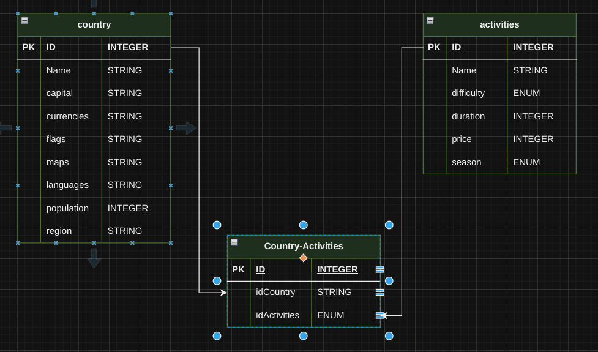

# API - REST

## BACKEND

## Se creara una API-REST que permita crear actividades turisticas de paises

Para ello se usara la API - RESTCountries [https://restcountries.com/] para tomar datos sobre paises y una API-REST propia, para el CRUD de actividades turisticas 

De **RESTCountries** se traeran todos los paises y se guardara en la DB Propia (allCountries), en esta tambien se haran CRUD sobre las actividades turisticas que ha su vez estaran relacionadas con los paises

## RUTAS
    Se crear las rutas para la api-rest con node, express

### /allcountries 
    traera todos los paises de la api y los guardara DB
### /countryByName?name='name' 
    buscara en la DB los paises que coincidan parcial o total su nombre con el name pasado por query parameters y los devolvera
### /countryById/:id
    buscara en la DB un pais que coincida con el :id dado por params
### /activities
    traera de la DB todas las actividades turisticas

## DB
    Se creara la base de datos con Postgressql y sequelize

### Modelos 

**_*Activities tendra todos las prop requeridas_**

## Testing

### Se crearan los test usando JEST

#### Se testeara:

**Conexion con DB**
**Se comprobara que los modelos posean las props necesarias**

**Petición /countries** Devuelva un array de todos los paises
**Petición /countries?name='name'** devuelva un array de todos los paises que coincidan parcialmente con "name"
**Petición /countries/:id** Devuelva un pais que coincida con el id 

**Petición /activities** Devuelva un arreglo con todas las actividades